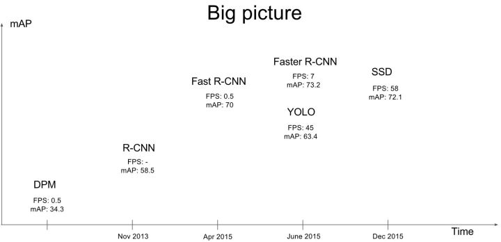
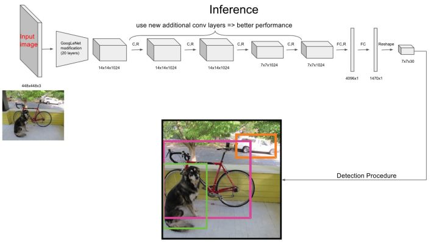

# 1 Yolo V1 
- YOLO Nano: a Highly Compact You Only Look Once Convolutional Neural Network for Object Detection. [paper](https://arxiv.org/abs/1910.01271).   
- This repo is based on [liux0614]( https://github.com/liux0614/yolo_nano).   

Yolo V1介绍   
参考博客：https://zhuanlan.zhihu.com/p/32525231   


### 前言

当我们谈起计算机视觉时，首先想到的就是图像分类，没错，图像分类是计算机视觉最基本的任务之一，但是在图像分类的基础上，还有更复杂和有意思的任务，如目标检测，物体定位，图像分割等，见图1所示。其中目标检测是一件比较实际的且具有挑战性的计算机视觉任务，其可以看成图像分类与定位的结合，给定一张图片，目标检测系统要能够识别出图片的目标并给出其位置，由于图片中目标数是不定的，且要给出目标的精确位置，目标检测相比分类任务更复杂。目标检测的一个实际应用场景就是无人驾驶，如果能够在无人车上装载一个有效的目标检测系统，那么无人车将和人一样有了眼睛，可以快速地检测出前面的行人与车辆，从而作出实时决策。


近几年来，目标检测算法取得了很大的突破。比较流行的算法可以分为两类，一类是基于Region Proposal的R-CNN系算法（R-CNN，Fast R-CNN, Faster R-CNN），它们是two-stage的，需要先使用启发式方法（selective search）或者CNN网络（RPN）产生Region Proposal，然后再在Region Proposal上做分类与回归。而另一类是Yolo，SSD这类one-stage算法，其仅仅使用一个CNN网络直接预测不同目标的类别与位置。第一类方法是准确度高一些，但是速度慢，但是第二类算法是速度快，但是准确性要低一些。这可以在图2中看到。本文介绍的是Yolo算法，其全称是You Only Look Once: Unified, Real-Time Object Detection，其实个人觉得这个题目取得非常好，基本上把Yolo算法的特点概括全了：You Only Look Once说的是只需要一次CNN运算，Unified指的是这是一个统一的框架，提供end-to-end的预测，而Real-Time体现是Yolo算法速度快。这里我们谈的是Yolo-v1版本算法，其性能是差于后来的SSD算法的，但是Yolo后来也继续进行改进，产生了Yolo9000算法。本文主要讲述Yolo-v1算法的原理，特别是算法的训练与预测中详细细节。

   


### 滑动窗口与CNN

在介绍Yolo算法之前，首先先介绍一下滑动窗口技术，这对我们理解Yolo算法是有帮助的。采用滑动窗口的目标检测算法思路非常简单，它将检测问题转化为了图像分类问题。其基本原理就是采用不同大小和比例（宽高比）的窗口在整张图片上以一定的步长进行滑动，然后对这些窗口对应的区域做图像分类，这样就可以实现对整张图片的检测了，如下图3所示，如DPM就是采用这种思路。但是这个方法有致命的缺点，就是你并不知道要检测的目标大小是什么规模，所以你要设置不同大小和比例的窗口去滑动，而且还要选取合适的步长。但是这样会产生很多的子区域，并且都要经过分类器去做预测，这需要很大的计算量，所以你的分类器不能太复杂，因为要保证速度。解决思路之一就是减少要分类的子区域，这就是R-CNN的一个改进策略，其采用了selective search方法来找到最有可能包含目标的子区域（Region Proposal），其实可以看成采用启发式方法过滤掉很多子区域，这会提升效率。    


如果你使用的是CNN分类器，那么滑动窗口是非常耗时的。但是结合卷积运算的特点，我们可以使用CNN实现更高效的滑动窗口方法。这里要介绍的是一种全卷积的方法，简单来说就是网络中用卷积层代替了全连接层，如图4所示。输入图片大小是16x16，经过一系列卷积操作，提取了2x2的特征图，但是这个2x2的图上每个元素都是和原图是一一对应的，如图上蓝色的格子对应蓝色的区域，这不就是相当于在原图上做大小为14x14的窗口滑动，且步长为2，共产生4个字区域。最终输出的通道数为4，可以看成4个类别的预测概率值，这样一次CNN计算就可以实现窗口滑动的所有子区域的分类预测。这其实是overfeat算法的思路。之所可以CNN可以实现这样的效果是因为卷积操作的特性，就是图片的空间位置信息的不变性，尽管卷积过程中图片大小减少，但是位置对应关系还是保存的。说点题外话，这个思路也被R-CNN借鉴，从而诞生了Fast R-cNN算法。


上面尽管可以减少滑动窗口的计算量，但是只是针对一个固定大小与步长的窗口，这是远远不够的。Yolo算法很好的解决了这个问题，它不再是窗口滑动了，而是直接将原始图片分割成互不重合的小方块，然后通过卷积最后生产这样大小的特征图，基于上面的分析，可以认为特征图的每个元素也是对应原始图片的一个小方块，然后用每个元素来可以预测那些中心点在该小方格内的目标，这就是Yolo算法的朴素思想。下面将详细介绍Yolo算法的设计理念。

### 设计理念

整体来看，Yolo算法采用一个单独的CNN模型实现end-to-end的目标检测，整个系统如图5所示：首先将输入图片resize到448x448，然后送入CNN网络，最后处理网络预测结果得到检测的目标。相比R-CNN算法，其是一个统一的框架，其速度更快，而且Yolo的训练过程也是end-to-end的。

.  
.  
.  
.  
.  

### 网络设计

Yolo采用卷积网络来提取特征，然后使用全连接层来得到预测值。网络结构参考GooLeNet模型，包含24个卷积层和2个全连接层，如图8所示。对于卷积层，主要使用1x1卷积来做channle reduction，然后紧跟3x3卷积。对于卷积层和全连接层，采用Leaky ReLU激活函数：max(x, 0.1x) 。但是最后一层却采用线性激活函数。    

.   
.  
.  

### 网络训练

在训练之前，先在ImageNet上进行了预训练，其预训练的分类模型采用图8中前20个卷积层，然后添加一个average-pool层和全连接层。预训练之后，在预训练得到的20层卷积层之上加上随机初始化的4个卷积层和2个全连接层。由于检测任务一般需要更高清的图片，所以将网络的输入从224x224增加到了448x448。整个网络的流程如下图所示：

.  
.  
. 
.  

### 网络预测

在说明Yolo算法的预测过程之前，这里先介绍一下非极大值抑制算法（non maximum suppression, NMS），这个算法不单单是针对Yolo算法的，而是所有的检测算法中都会用到。NMS算法主要解决的是一个目标被多次检测的问题，如图11中人脸检测，可以看到人脸被多次检测，但是其实我们希望最后仅仅输出其中一个最好的预测框，比如对于美女，只想要红色那个检测结果。那么可以采用NMS算法来实现这样的效果：首先从所有的检测框中找到置信度最大的那个框，然后挨个计算其与剩余框的IOU，如果其值大于一定阈值（重合度过高），那么就将该框剔除；然后对剩余的检测框重复上述过程，直到处理完所有的检测框。Yolo预测过程也需要用到NMS算法。

. 

.   

.   
### 算法性能分析

这里看一下Yolo算法在PASCAL VOC 2007数据集上的性能，这里Yolo与其它检测算法做了对比，包括DPM，R-CNN，Fast R-CNN以及Faster R-CNN。其对比结果如表1所示。与实时性检测方法DPM对比，可以看到Yolo算法可以在较高的mAP上达到较快的检测速度，其中Fast Yolo算法比快速DPM还快，而且mAP是远高于DPM。但是相比Faster R-CNN，Yolo的mAP稍低，但是速度更快。所以。Yolo算法算是在速度与准确度上做了折中。

.  

为了进一步分析Yolo算法，文章还做了误差分析，将预测结果按照分类与定位准确性分成以下5类：

* Correct：类别正确，IOU>0.5；（准确度）
* Localization：类别正确，0.1 < IOU<0.5（定位不准）；
* Similar：类别相似，IOU>0.1；
* Other：类别错误，IOU>0.1；
* Background：对任何目标其IOU<0.1。（误把背景当物体）

Yolo与Fast R-CNN的误差对比分析如下图所示：
.  
可以看到，Yolo的Correct的是低于Fast R-CNN。另外Yolo的Localization误差偏高，即定位不是很准确。但是Yolo的Background误差很低，说明其对背景的误判率较低。Yolo的那篇文章中还有更多性能对比，感兴趣可以看看。

现在来总结一下Yolo的优缺点。首先是优点，Yolo采用一个CNN网络来实现检测，是单管道策略，其训练与预测都是end-to-end，所以Yolo算法比较简洁且速度快。第二点由于Yolo是对整张图片做卷积，所以其在检测目标有更大的视野，它不容易对背景误判。其实我觉得全连接层也是对这个有贡献的，因为全连接起到了attention的作用。另外，Yolo的泛化能力强，在做迁移时，模型鲁棒性高。

最后不得不谈一下Yolo的缺点，首先Yolo各个单元格仅仅预测两个边界框，而且属于一个类别。对于小物体，Yolo的表现会不如人意。这方面的改进可以看SSD，其采用多尺度单元格。也可以看Faster R-CNN，其采用了anchor boxes。Yolo对于在物体的宽高比方面泛化率低，就是无法定位不寻常比例的物体。当然Yolo的定位不准确也是很大的问题。

# 2 Project Structure


# 3 数据集

# 4 开发环境

# 5 代码

# 6 部署Nano


# 
<pre>
root/
  datasets/
    coco/
      images/
        train/
        val/
      annotation/
        instances_train2017.json
</pre>

# Installation
```bash
git clone https://github.com/wangsssky/YOLO-Nano.git
pip3 install -r requirements.txt
```
# COCO
To use COCO dataset loader, _pycocotools_ should be installed via the following command.
```bash 
pip install "git+https://github.com/philferriere/cocoapi.git#egg=pycocotools&subdirectory=PythonAPI"
```

To train on COCO dataset:
```bash
python3 main.py --dataset_path datasets/coco/images --annotation_path datasets/coco/annotations 
                --dataset coco --conf_thresh=0.8 --gpu
```

# Convert to onnx
- cd deploy, run convert2onnx.py
- run ```python -m onnxsim yolo-nano.onnx simplified.onnx```, you may install onnx-simplifier first.
- try run_onnx.py, test it by onnx runtime
